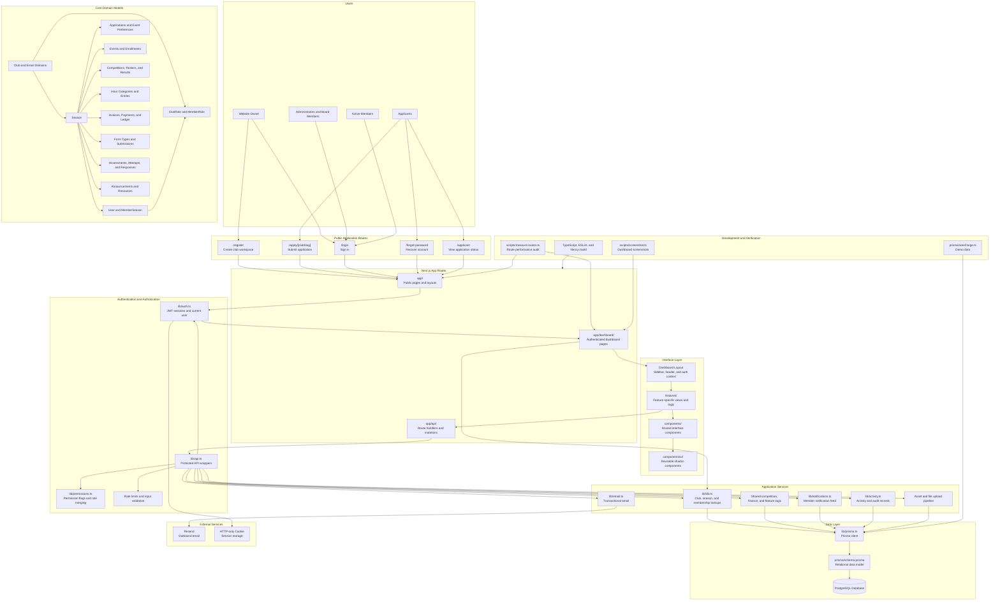
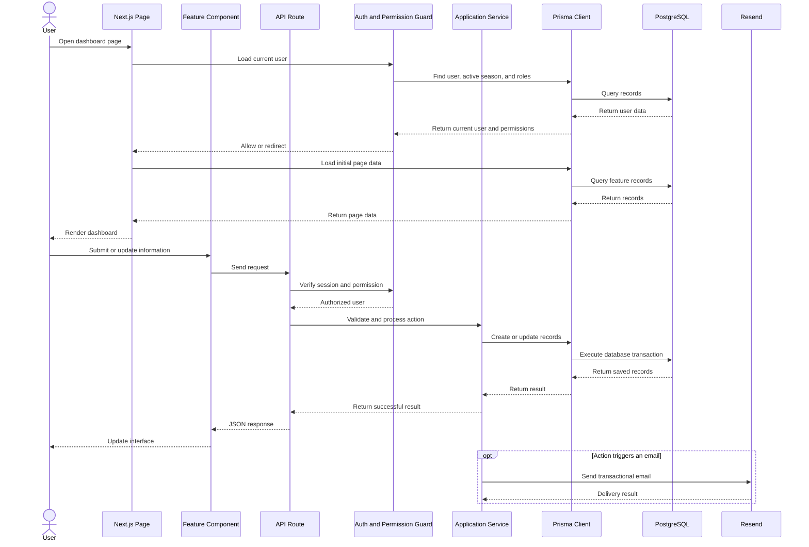
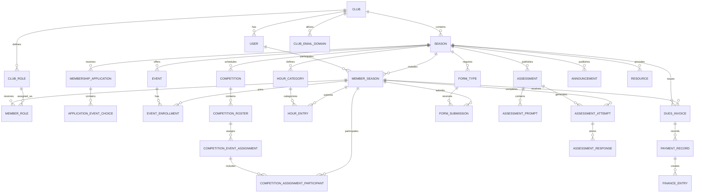

# Scioly

A full-stack club management platform for Science Olympiad teams. One dashboard for the whole season that includes applications, hours, dues, forms, competitions, rosters, practice tests, results, resources, announcements, and email.

Built to replace the usual sprawl of Google Sheets, Drive folders, and group-chat reminders that most clubs run on.

## Features

### Applications

The Applications section manages the complete process of joining the club. Students submit an application through a public club-specific page, including their personal information, experience, and preferred Science Olympiad events. Authorized users can review applications, leave decision notes, and approve, deny, or waitlist applicants. When an applicant is approved, the system creates their membership record and sends them a time-limited link to set up their password and access the member dashboard.

### Members

The Members section provides a central directory for everyone participating in the club. Each person has a permanent user account as well as a separate membership record for each season, allowing the club to preserve past participation while tracking current status, grade level, contact details, returning-member status, and assigned roles. Administrators can use this area to manage member profiles, activate or remove memberships, and assign custom roles that determine which parts of the platform each member can access.

### Events

The Events section stores and organizes the individual Science Olympiad events offered during a season, such as Astronomy, Codebusters, and Forensics. Each event can include an abbreviation, description, participant limits, trial-event status, and display order. Members can express interest in events, rank their preferences, and receive enrollment statuses or tryout scores, giving club leaders the information needed to make informed team assignments.

### Competitions

The Competitions section helps club leaders plan tournaments and manage the teams attending them. Administrators can create practice, invitational, regional, state, or national competitions, add dates and locations, publish competition information, build rosters, and assign students to individual events, rooms, and time slots. The roster system also supports participant roles, schedule conflict detection, automatic assignments, and the recording of placements, scores, and medal notes after the competition.

### Announcements

The Announcements section allows club leaders to communicate important information directly through the platform. Announcements can be saved as drafts, scheduled for future publication, pinned for greater visibility, or given an expiration date so outdated information disappears automatically. They can also be targeted to an entire season or connected to a specific event, competition, season roster, or competition roster, allowing members to receive information that is relevant to their assignments.

### Hours

The Hours section tracks volunteer work, fundraising, preparation time, and other participation requirements. Club leaders can create categories with required totals, evidence requirements, and maximum hours allowed per submission, while members can submit entries with descriptions and supporting proof. Entries may be automatically approved or placed into an administrative review queue, where they can be approved or rejected with a reason, and members can monitor how many approved hours they have completed during the season.

### Finances

The Finances section manages club dues, invoices, payments, and accounting records. Administrators can issue invoices to members, record partial or complete payments through methods such as cash, check, Zelle, Venmo, or PayPal, and automatically update each invoice’s remaining balance. Every payment can also be linked to the club’s broader finance ledger, while members receive a personal view of their open invoices, payment history, and outstanding obligations.

### Forms

The Forms section organizes required documents such as waivers, medical forms, permission slips, codes of conduct, and travel forms. Administrators can define whether a form is required, assign a due date, and specify whether a file upload is necessary. Members can submit signed documents through the platform, and authorized users can verify or reject each submission, provide a rejection reason, and track which members have completed their requirements.

### Club Events

The Club Events section manages activities that take place outside formal competitions, including meetings, workshops, fundraisers, field trips, and Super Saturdays. Each event can include a location, start and end time, notes, and an optional number of participation hours. Administrators can record attendance, and attended events can automatically generate hour entries for members when the event is connected to an hour category.

### Assessments

The Assessments section gives members a structured way to prepare for Science Olympiad events. Administrators can create curated tests with source PDFs, multiple-choice or written-response questions, point values, difficulty levels, answer keys, and subtopic tags. Members can also generate personalized practice tests by selecting an event, question format, difficulty, number of questions, and time limit, while the platform records attempts, responses, scores, and recent performance trends.

### Resources

The Resources section provides a central location for study materials and club documents. Administrators can add links, files, documents, videos, spreadsheets, and folders, then make each resource available to the entire season or associate it with a particular event, competition, season roster, or competition roster. Members only see resources connected to the events and teams in which they participate, helping keep the study library organized and relevant.

### Permissions

The Permissions feature controls what each user is allowed to view and manage throughout the platform. The website owner has complete access, while other users receive permissions through customizable roles such as Administrator, Board Member, Event Captain, or Member. Permissions can be assigned separately for viewing, creating, editing, and deleting content across areas such as members, events, competitions, hours, finances, forms, assessments, and club settings. When a user has multiple roles, the system combines their permissions. Access is enforced in both the interface and the server, so restricted pages, buttons, and API actions remain unavailable to unauthorized users.

## User Flow

### 1. Create a Club Workspace

A club leader begins at `/register`, where they create a Science Olympiad workspace and the primary website owner account. The registration process creates the club, its initial season, the owner account, and the default permission roles needed to begin managing the organization.

### 2. Configure the Active Season

After signing in, the website owner prepares the workspace for the current season. This includes adding Science Olympiad events, creating hour categories, defining required forms, configuring club roles, and reviewing general club settings. These records provide the foundation for applications, memberships, competitions, and other season activities.

### 3. Accept Applications

Students apply through the public `/apply/<club-slug>` page. They provide their personal information, experience, and preferred Science Olympiad events. After submitting the application, they can visit `/applicant` to view their status, read decision notes, or withdraw before a final decision is made.

### 4. Review and Admit Members

Authorized club leaders review submitted applications from the Applications page. Applicants can be approved, denied, or waitlisted individually or in bulk. When an application is approved, the system creates the member's seasonal membership and generates a password setup token that remains valid for 72 hours.

### 5. Set Up an Account

The approved member receives an email containing a password setup link. After creating a password, the member can sign in through `/login` and access the dashboard. Members who lose the setup link or forget their password can use `/forgot-password`, while administrators can resend the setup link from the member's profile.

### 6. Assign Roles and Events

Once admitted, members can be assigned one or more club roles that determine which pages and actions they can access. Club leaders can also review each member's event preferences, record tryout information, update enrollment statuses, and determine which Science Olympiad events the member will prepare for during the season.

### 7. Participate During the Season

Members use the dashboard to follow announcements, review assigned competitions, access study resources, complete required forms, submit hours, view invoices, and take practice assessments. The dashboard presents information based on the member's active season, event enrollments, roster assignments, and permissions.

### 8. Review Member Submissions

Club leaders monitor administrative review queues throughout the season. They can approve or reject hour entries, verify submitted forms, record payments, update member information, and send reminders when requirements remain incomplete. Members can return to their dashboard to view updated statuses and address rejected or missing items.

### 9. Prepare for Competitions

Before a tournament, club leaders create the competition, publish its details, build one or more rosters, and assign members to events. They can organize event partners, rooms, time blocks, and participant roles while checking for scheduling conflicts. Members then view their personal assignments and competition schedule from the dashboard.

### 10. Practice and Compete

Members prepare using curated or generated assessments and resources connected to their assigned events. Their attempts, responses, scores, and recent performance are recorded in the platform. After the tournament, authorized users enter placements, scores, and medal notes for each event assignment.

### 11. Track Season Progress

Throughout the season, the platform keeps applications, memberships, hours, forms, finances, practice results, competition assignments, and results connected to the active season. Club leaders use this information to monitor participation and identify incomplete requirements, while members use their personal dashboard to track their own responsibilities and progress.

### 12. Begin a New Season

When the season ends, club leaders can create and activate a new season without deleting previous records. Permanent user accounts remain in the system, while new seasonal membership records allow returning members, roles, event assignments, requirements, and results to be managed separately for the next year.

## Architecture

### Request Flow

### Data Model

