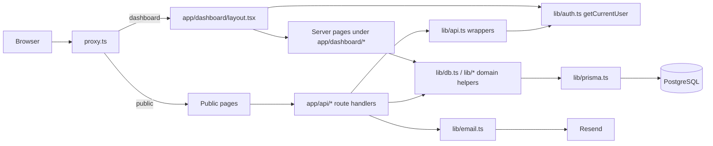
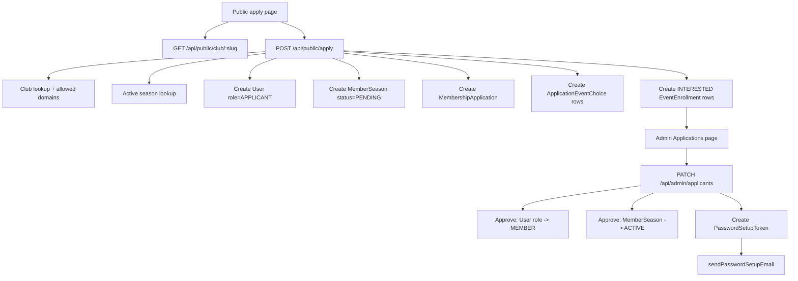
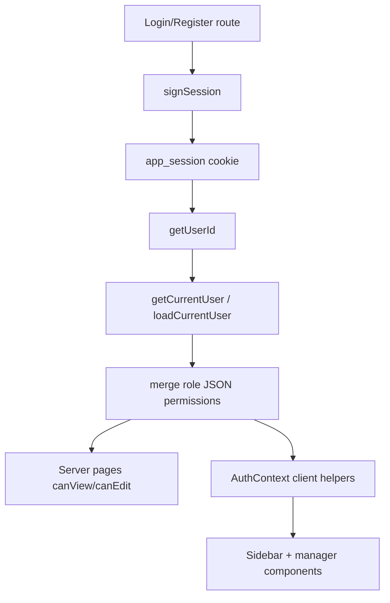
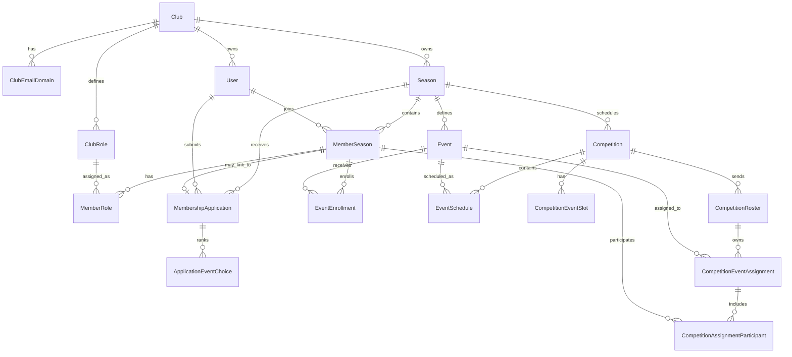
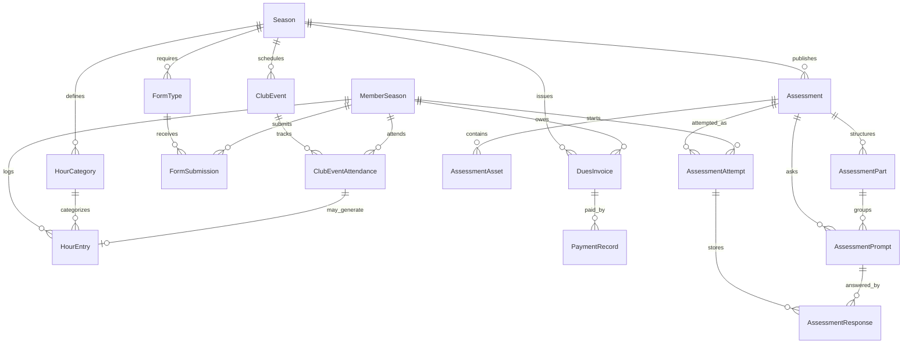

# CODEBASE KNOWLEDGE

## Audit Context

- Audit date: 2026-04-08
- Repository root: `/Users/musung/Desktop/scioly`
- Baseline used: current checked-out worktree, not just the last clean commit
- Important caveat: `git status` shows a large in-flight refactor. Several critical files in the competition, practice, rate-limit, member-hub, and domain-management areas are currently untracked or heavily modified. This document therefore reflects the code that exists on disk today, plus git history where history exists.

## High-Level Overview

### Purpose

SciOly Club Manager is a private full-stack web app for running a Science Olympiad club through an entire season. The product covers:

- club self-registration and domain-gated identity
- public student applications
- admin review and approval
- member profiles and role permissions
- event enrollment and competition planning
- club event attendance and hour tracking
- dues invoicing and payment recording
- required form tracking
- practice assessments and member attempts

### Technology Stack

| Layer | Current implementation |
|---|---|
| Framework | Next.js App Router (`next@16.1.6`) |
| UI | React 19, TypeScript, Tailwind CSS 4, shadcn-style components, Radix primitives |
| Data access | Prisma 7 with PostgreSQL via `@prisma/adapter-pg` |
| Auth | Custom JWT auth with `jose`, `bcryptjs`, `httpOnly` cookie session |
| Email | Resend |
| Tables/charts | TanStack Table, Recharts |
| Validation | Zod |

### Architecture Type

This is a monolithic full-stack Next.js application with a vertical-slice structure:

- server-rendered App Router pages fetch directly from Prisma
- client-side "manager" components call route handlers under `app/api/*`
- shared cross-cutting logic lives in `lib/*`
- authorization is permission-map-based, not role-switch-based
- PostgreSQL is the system of record for nearly all workflows

This is not a layered service-oriented backend. Most business logic is split between:

- route handlers in `app/api/*`
- domain helper modules in `lib/*`
- page-specific client state machines in `app/dashboard/**`

## Critical File Map

| Area | Key files | What they do |
|---|---|---|
| Global shell | `app/layout.tsx`, `app/dashboard/layout.tsx`, `proxy.ts`, `components/app-sidebar.tsx` | Fonts, toasts, auth-aware dashboard shell, route gating, navigation from permission map |
| Auth/session | `lib/auth.ts`, `lib/cookies.ts`, `app/api/auth/login/route.ts`, `app/api/auth/register/route.ts`, `app/api/auth/set-password/route.ts`, `context/AuthContext.tsx` | JWT signing/verification, current-user loading, session cookie writes, club self-registration, login, password setup, client auth context |
| Shared guards | `lib/api.ts`, `lib/permissions.ts` | `withPermission`, `withAnyPermission`, `withMemberAuth`, flat permission map helpers |
| Shared data helpers | `lib/db.ts`, `lib/rate-limit.ts`, `lib/email-domains.ts`, `lib/email.ts` | active-season/member-season lookup cache, DB-backed rate limiting, domain allow-listing, outbound email |
| Data model | `prisma/schema.prisma`, `prisma/seed.ts`, `prisma/migrations/*` | relational ontology, seeds, migration history |
| Admissions | `app/api/public/apply/route.ts`, `app/api/public/club/[slug]/route.ts`, `lib/applications.ts`, `app/api/admin/applicants/route.ts` | public club metadata, application submission, pending-applicant list, approve/deny flow |
| Members/settings | `app/api/admin/members/*`, `app/api/admin/roles/*`, `app/api/admin/settings*`, `app/api/admin/seasons*`, `app/dashboard/settings/*` | member detail, role assignment, club settings, domain allow-list, seasons, permissions UI |
| Events/competitions | `app/api/admin/events/*`, `app/api/admin/competitions/*`, `lib/competition-event-sync.ts`, `lib/competition-ontology.ts`, `app/dashboard/competitions/[id]/competition-roster-manager.tsx` | season events, competition schedule sync, canonical roster/assignment model |
| Activity/ops | `app/api/admin/hours/*`, `app/api/admin/forms/*`, `app/api/admin/dues*`, `app/api/admin/club-events*`, `app/api/admin/email/route.ts` | hours, forms, dues, club events, reminder emails |
| Practice | `lib/practice-assessments.ts`, `app/api/admin/practice/*`, `app/api/member/practice*`, `app/dashboard/practice/*`, `components/forms/practice-test-form.tsx` | assessment CRUD, answer keys, attempts, scoring, member practice UX |
| Member hub | `app/api/member/hub/route.ts` | aggregated member dashboard payload combining practice, hours, forms, finances, events, and competition assignments |

## Entry Points And Request Flow

### Primary entry points

- `app/layout.tsx`: global root layout, fonts, toaster, root `AuthProvider`
- `proxy.ts`: redirects unauthenticated users away from `/dashboard/*`, and authenticated users away from `/login`, `/register`, `/set-password`
- `app/dashboard/layout.tsx`: authenticated dashboard shell; calls `getCurrentUser()` and redirects to `/login` if missing
- `app/page.tsx`: public landing page
- `app/register/page.tsx`: club self-registration
- `app/apply/[clubSlug]/page.tsx`: public student application page

### Runtime architecture



### Server vs client split

- Server pages are used for initial page rendering and permission gating.
- Client components handle modal-heavy CRUD flows and call REST-like route handlers.
- Shared domain modules in `lib/*` are reused by both server pages and API routes when logic is large enough to warrant extraction.

## Key Components And Data Flow

### 1. Admissions And Onboarding

Public applications are club-slug-driven and active-season-driven.



Observed implementation details:

- Public apply already creates `User` and `MemberSeason` before approval.
- Review state is also written to `MembershipApplication`.
- Approval sends a password-setup email with a 72-hour token.

### 2. Auth And Permission Gating



Important behavior:

- `WEBSITE_OWNER` bypasses role lookup by receiving `allPermissions()`.
- non-owner permissions come from season-specific `MemberRole -> ClubRole.permissions`.
- `AuthContext` mirrors the server-side permission helpers on the client.
- both `lib/auth.ts` and `lib/db.ts` keep small in-memory TTL caches to reduce repeated Prisma lookups.

### 3. Competition Planning

The current worktree has moved away from the older `Team` model toward a more explicit competition ontology.

```mermaid
flowchart TD
    E[Season Events] --> S[lib/competition-event-sync.ts]
    S --> ES[EventSchedule]
    S --> CS[CompetitionEventSlot]

    CR[CompetitionRoster] --> CA[CompetitionEventAssignment]
    ES --> CA
    CS --> CA
    EV[Event] --> CA
    CA --> CP[CompetitionAssignmentParticipant]
    CP --> MS[MemberSeason]

    UI[competition-roster-manager.tsx] --> RA[/api/admin/competitions/:id/rosters/*]
    RA --> CO[lib/competition-ontology.ts]
    CO --> CR
```

Observed implementation details:

- creating a competition or adding/removing a season event triggers schedule/slot sync
- canonical roster reads are centralized in `lib/competition-ontology.ts`
- assignment create/update tries to infer schedule/slot/room/block from canonical event placement if not explicitly supplied
- the competition detail page exposes two tabs: canonical rosters and schedule

### 4. Practice Assessment Flow

```mermaid
flowchart TD
    A[Admin PracticeManager] --> B[/api/admin/practice]
    B --> C[lib/practice-assessments.ts]
    C --> D[Assessment]
    C --> E[AssessmentAsset]
    C --> F[AssessmentPart]
    C --> G[AssessmentPrompt]

    M[Member PracticeFeed] --> H[/api/member/practice/feed]
    H --> C
    M --> I[/api/member/practice/:assessmentId]
    I --> C
    I --> J[startOrResumePracticeAssessmentAttempt]
    J --> K[AssessmentAttempt]
    K --> L[AttemptWorkspace autosave]
    L --> N[/api/member/practice/attempts/:attemptId PATCH]
    N --> O[AssessmentResponse upserts]
    L --> P[/api/member/practice/attempts/:attemptId POST]
    P --> Q[auto-score against answerKeyText]
```

Observed implementation details:

- admin assessments are PDF-first, not parser-first
- parts support `SECTION` and `STATION`
- prompts are answer slots, not necessarily fully modeled question text
- member attempts autosave every 600ms through the attempt workspace
- submission can auto-score exact text matches where answer keys exist
- practice recommendations are derived from the member's current event enrollments

## Core Feature Breakdown

### Auth, Session, And Tenant Boundary

The tenant boundary is `Club`, but the code does not force a literal `clubId` column on every model. Many models are season-scoped and rely on relational joins for tenant isolation. This matches the local architecture reset docs and the current Prisma schema.

Session handling is custom:

- `lib/auth.ts` signs JWTs and reads `app_session`
- `getCurrentUser()` loads the user, active-season roles, and primary club domain
- `proxy.ts` does route-level redirection
- `app/dashboard/layout.tsx` enforces authenticated dashboard access

### Domain Allow-Listing

School identity is now modeled with both:

- `Club.schoolDomain`
- `ClubEmailDomain[]`

Auth and application flows read the computed allow-list from `lib/db.ts` and `lib/email-domains.ts`. This is a meaningful shift away from single-domain-only enforcement.

### Club Self-Registration

`app/api/auth/register/route.ts` creates:

- `Club`
- `WEBSITE_OWNER` `User`
- default `ClubRole` rows (`Admin`, `Board Member`, `Member`)

It also normalizes the primary email domain and writes it into the separate domain table.

Git history:

- commit `e134a50` on 2026-03-30 introduced this API

### Admissions

Admissions are transitional. The code now has a dedicated `MembershipApplication` model, but the public apply route still creates `User` + `MemberSeason` at submission time and keeps legacy application text on `MemberSeason`.

Admin review is implemented in `app/api/admin/applicants/route.ts`:

- deny: `MemberSeason.membershipStatus -> REMOVED`, `MembershipApplication.status -> DENIED`
- approve: `User.role -> MEMBER`, `MemberSeason.membershipStatus -> ACTIVE`, password token created, welcome email sent

The applications page renders `listPendingApplicants()` from `lib/applications.ts`.

### Members And Role Assignment

Member list and detail pages are server-rendered and fetch directly from Prisma.

Role assignment is separate from system role:

- `User.role` handles system-level identity (`WEBSITE_OWNER`, `MEMBER`, `APPLICANT`)
- `ClubRole` stores permission JSON per club
- `MemberRole` attaches those role definitions to a `MemberSeason`

This means:

- one user can have different club permissions each season
- `WEBSITE_OWNER` remains a global bypass inside a single club

Git history:

- commit `159f1c9` on 2026-03-30 introduced the permission-map system
- commit `f39145a` on 2026-03-30 shifted `getCurrentUser()` to return merged permissions

### Events And Event Enrollment

Season events live in `Event`.

Key behavior:

- admin CRUD routes are in `app/api/admin/events/*`
- member interest/tryout status lives in `EventEnrollment`
- public applications can pre-create `INTERESTED` enrollments for selected events
- member hub uses enrollments to compute practice recommendations

### Competitions

The current worktree's competition model is materially different from the repository's original migration history.

Current runtime model:

- `Competition`
- `EventSchedule`
- `SeasonRoster`
- `CompetitionRoster`
- `CompetitionEventSlot`
- `CompetitionEventAssignment`
- `CompetitionAssignmentParticipant`

Older migration history still references:

- `Team`
- `Tournament`
- `TournamentEventAssignment`
- `AssignmentMember`

The competition detail page shows that the intended runtime path is now the canonical roster/assignment model, not the older team model.

### Club Events And Attendance-Linked Hours

Club events are operational events like meetings, workshops, and Super Saturdays.

Key behavior:

- admin CRUD routes manage `ClubEvent`
- attendance is stored in `ClubEventAttendance`
- when attendance is added and the event has both `hoursValue` and `categoryId`, the code auto-creates or updates an approved `HourEntry`
- when attendance is removed, that linked hour entry is removed too

This is the cleanest example of business logic living in an API route rather than a separate service layer.

### Hours

The hours system has a richer schema than the current UI uses.

Runtime usage today:

- member submits `HourEntry`
- admin approves/rejects `HourEntry`
- `HourCategory` is used for requirement buckets and proof instructions
- club-event attendance can generate approved hours

Schema not fully surfaced today:

- `HourProgram`
- `HourEvidencePolicy`
- `maxHoursPerEntry`

### Forms

Forms are season-scoped requirements:

- `FormType` defines the requirement
- `FormSubmission` stores each member's status

Member flow:

- list forms
- acknowledge or upload a URL
- mark as `SUBMITTED`

Admin flow:

- create/edit/delete form types
- verify or reject submissions
- send reminder emails

### Finances

The implemented finance flow is dues-centric:

- `DuesInvoice`
- `PaymentRecord`

The UI supports:

- invoice creation
- payment recording
- voiding invoices

The schema also contains a more general ledger layer:

- `FinanceAccount`
- `FinanceEntry`

That ledger layer is currently dormant in the UI and in most route handlers.

### Practice Assessments

This is one of the largest and most mature feature areas in the current worktree.

Admin capabilities:

- create assessments
- link packet and answer-key PDFs by URL
- add sections/stations
- publish/archive
- maintain ordered answer keys

Member capabilities:

- browse recommended and available assessments
- start or resume attempts
- autosave responses
- submit and receive auto-scoring when answer keys exist

The main implementation hub is `lib/practice-assessments.ts`, which acts as both query layer and domain service.

### Member Hub

`app/api/member/hub/route.ts` is a BFF-style aggregator endpoint. It combines:

- member profile
- season metadata
- enrollments
- required forms
- open invoices
- hours progress
- recent hour entries
- upcoming club events
- practice feed and streak stats
- season rosters
- competition assignments

This endpoint effectively defines the member-facing dashboard contract, even though the server-rendered `/dashboard` page itself is still more admin-oriented.

## Database / Schema Map

### Domain Clusters

#### Tenant, identity, and permissions

- `Club`
- `ClubEmailDomain`
- `User`
- `PasswordSetupToken`
- `ClubRole`

#### Season membership and admissions

- `Season`
- `MemberSeason`
- `MembershipApplication`
- `ApplicationEventChoice`
- `MemberRole`

#### Science Olympiad operations

- `Event`
- `EventEnrollment`
- `Competition`
- `EventSchedule`
- `SeasonRoster`
- `SeasonRosterMember`
- `CompetitionRoster`
- `CompetitionEventSlot`
- `CompetitionEventAssignment`
- `CompetitionAssignmentParticipant`

#### Activity and administration

- `HourProgram`
- `HourCategory`
- `HourEntry`
- `ClubEvent`
- `ClubEventAttendance`
- `DuesInvoice`
- `PaymentRecord`
- `FinanceAccount`
- `FinanceEntry`
- `FormType`
- `FormSubmission`

#### Practice and content

- `Assessment`
- `AssessmentAsset`
- `AssessmentPart`
- `AssessmentPrompt`
- `AssessmentAttempt`
- `AssessmentResponse`
- `Asset`
- `Resource`
- `Announcement`

#### Platform support

- `RateLimitBucket`
- `ActivityLog`

### Core Entity Relationship Map



### Activity And Practice Relationship Map



## Git History And Design Intent

Where history exists, the major steps are:

- `159f1c9` on 2026-03-30: introduced the permission-map system
- `f39145a` on 2026-03-30: made `getCurrentUser()` return merged permissions
- `6ee436d` on 2026-03-30: enforced club school-domain checks during login
- `e134a50` on 2026-03-30: added club self-registration
- `3fc7ec4` on 2026-04-01: added club events, practice test pages, answer-key flow, member practice routes, and the Discord-style roles UI

Where history does not exist in git yet, local spec documents explain the intended architectural shift:

- `docs/superpowers/specs/2026-04-06-scioly-platform-architecture-reset.md`
- `docs/superpowers/specs/2026-04-06-scioly-platform-realignment.md`

Those specs align closely with the current untracked worktree changes:

- shift from `Team`/`Test` semantics toward `CompetitionRoster`/`Assessment`
- move from single-domain gating toward first-class `ClubEmailDomain`
- treat `MembershipApplication` as the admissions system of record

## Risky Spots / Technical Debt

### 1. The schema and migration history are out of sync

Evidence:

- `prisma/schema.prisma` now models `CompetitionRoster`, `CompetitionEventAssignment`, `Assessment*`, and `ClubEmailDomain`
- the initial checked-in migration still creates legacy `Team`, `Tournament`, and `Test*` tables and even older enum values like `ADMIN` and `BOARD_MEMBER`
- `/dashboard/teams/*` and `/api/admin/teams/*` are being deleted from the worktree

Risk:

- a fresh database created only from checked-in migrations will not cleanly represent the current runtime ontology
- rollback and onboarding risk is high until the migration story is stabilized

### 2. Core runtime behavior currently lives in an in-flight dirty worktree

Evidence:

- `git status` shows large modified and untracked changes across schema, auth, practice, competitions, member hub, and settings
- several key runtime files (`lib/practice-assessments.ts`, `lib/competition-ontology.ts`, `lib/competition-event-sync.ts`, member hub routes) are not yet part of commit history

Risk:

- design intent is hard to reconstruct later
- reviewability and rollback are weak

### 3. README and runtime configuration have drifted

Evidence:

- README says Next.js 15; `package.json` uses Next.js 16.1.6
- README documents `JWT_SECRET`; `lib/auth.ts` reads `APP_JWT_SECRET`

Risk:

- environment setup errors
- misleading onboarding docs

### 4. Role UI and role schema are partially mismatched

Evidence:

- `RolesManager` exposes a color picker and sends `color`
- `ClubRole` schema has no `color` field
- role APIs do not validate or persist color

Risk:

- dead UI state
- false expectation that role colors are stored

### 5. Permission model is richer than the permissions UI

Evidence:

- `lib/permissions.ts` supports 40 flags across 10 areas
- `RolesManager` exposes only a narrower subset, mostly view/edit plus a few create/delete cases

Risk:

- operators may assume all permissions are manageable from the UI when they are not
- flag surface can drift from UI without being obvious

### 6. Event edits do not re-run competition sync

Evidence:

- event create/delete routes call `syncCompetitionEventsForSeason`
- event patch route does not

Risk:

- event `sortOrder`, `name`, or `code` changes can leave competition schedules or slot labels stale

### 7. Club event edits do not backfill linked hour entries

Evidence:

- attendance create/delete keeps `ClubEventAttendance.hourEntryId` in sync
- club event patch route only updates `ClubEvent`

Risk:

- if admins change `hoursValue`, `categoryId`, or event name after attendance exists, generated approved hour entries become stale

### 8. Finance ledger primitives exist but are not integrated

Evidence:

- schema contains `FinanceAccount` and `FinanceEntry`
- dues/payment flows only update `DuesInvoice` and `PaymentRecord`
- payment recording route does not create ledger entries

Risk:

- finances are split between implemented dues behavior and dormant generalized ledger design

### 9. Rate-limit fallback is overly broad

Evidence:

- `lib/rate-limit.ts` falls back to in-memory storage for any thrown `Error`, not only known schema-missing cases

Risk:

- multi-instance protection silently degrades during transient database failures
- production incidents can be masked as “working” in single-process memory

### 10. Transitional duplication still exists in admissions

Evidence:

- application essay fields are stored on both `MembershipApplication` and `MemberSeason`
- public apply creates `User` + `MemberSeason` before approval
- member detail page reads from both `application` and legacy `MemberSeason` fallback fields

Risk:

- duplicate source of truth
- future admissions changes must update both paths or accept drift

### 11. Several schema areas are currently dormant or placeholder-only

Evidence:

- `Resource`, `Announcement`, `Asset`, `FinanceAccount`, `FinanceEntry`, and much of `HourProgram` are not surfaced in the main dashboard workflows
- member hub currently returns `announcements: []` and `resources: []`

Risk:

- schema complexity is ahead of runtime usage
- new contributors will overestimate what is already implemented

### 12. Large files concentrate business logic without automated tests

Hotspots:

- `lib/practice-assessments.ts`
- `app/api/member/hub/route.ts`
- `app/dashboard/competitions/[id]/competition-roster-manager.tsx`
- `prisma/schema.prisma`

Evidence:

- there are no real test files or test scripts in the repository
- `package.json` exposes `lint` but no unit/integration test command

Risk:

- regressions are likely during the current ontology migration

## Overall Assessment

The codebase is structurally solid at the application-shell level:

- clear App Router layout
- centralized permission helpers
- consistent server-page + client-manager pattern
- a strong relational model for club operations

The main instability is not the shell. It is the ongoing ontology realignment:

- old `Team`/`Test` concepts are being replaced by `CompetitionRoster`/`Assessment`
- admissions are being split out from seasonal membership
- domain allow-listing is being normalized
- the schema is moving faster than the committed migrations and tests

The current direction is coherent, but the highest-value next step is stabilizing the migration story and adding regression coverage around auth, admissions, competition sync, and practice attempts.
